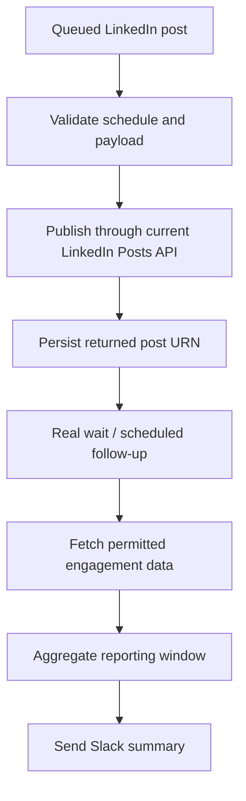

# LinkedIn Publishing & Engagement Template

> **Evidence status:** Legacy portfolio template — requires API and workflow repair before use.

This repository contains an importable n8n template exploring scheduled LinkedIn publishing and post-engagement reporting. It is retained as portfolio evidence of workflow decomposition, but the checked-in export should **not** be presented as a currently working LinkedIn automation.


---

**[Open the visual project page →](./index.html)**

## Intended flow



## What the checked-in export currently demonstrates

- webhook intake for post content and scheduled time;
- a time comparison branch;
- an HTTP publishing step;
- post-ID capture;
- placeholder engagement retrieval;
- Slack reporting structure.

## Known gaps found in the audit

The current `workflow/T27_LinkedIn_Auto_Publisher.json` export is **not ready for configured use**:

1. It calls the legacy `v2/ugcPosts` publishing endpoint. LinkedIn's current documentation directs new integrations to the versioned **Posts API**, which replaces `ugcPosts`.
2. The node named `Wait 24h` is a Set node that only writes the text `24 hours`; it does not actually pause execution.
3. The workflow labels the final Slack action as a weekly report, but the export contains no weekly aggregation window or persisted comparison of multiple posts.
4. Engagement retrieval is represented by a placeholder URL rather than a verified current LinkedIn endpoint and permission model.
5. The workflow export still contains a historical `Production` tag even though this repository is a template and has no production-deployment evidence.

These issues are documented deliberately rather than hidden behind a "production-ready" claim.

## Repair path

Before using this template:

- migrate publishing to the current versioned LinkedIn Posts API;
- add the required `Linkedin-Version` and Rest.li headers for the chosen supported API version;
- replace the pseudo-wait with a real n8n Wait node or schedule-backed continuation;
- persist post records if weekly comparison is required;
- implement engagement retrieval only with permissions available to the authenticated LinkedIn application;
- remove the historical `Production` workflow tag;
- run configured end-to-end tests before activation.

## Demo status

No configured live-run recording is included. Credentials and service identifiers remain placeholders.

## Setup

The file can be imported for inspection from:

`workflow/T27_LinkedIn_Auto_Publisher.json`

Do **not** activate it against a real account until the repair items above are completed and the current LinkedIn API requirements are verified.

## Repository structure

```text
.
├── index.html
├── README.md
├── LICENSE
├── .gitignore
└── workflow/
    └── T27_LinkedIn_Auto_Publisher.json
```

## Evidence boundary

This is a legacy portfolio/template asset. It does not claim a live deployment, a verified LinkedIn publishing integration, automated weekly analytics, customer use, or business outcomes.

---

Designed and engineered by **Oyekola Ololade**  
AI Systems & Automation Engineer

- [LinkedIn](https://www.linkedin.com/in/ololade-oyekola-5b1797397/)
- [GitHub](https://github.com/oyekola-ololade)
